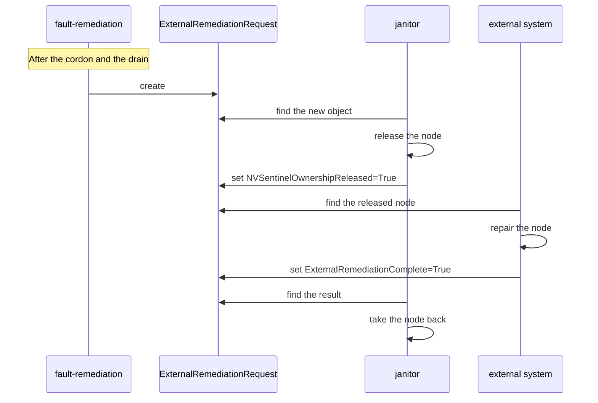

# Tutorial: Integrating External Remediation

This tutorial walks you through configuring NVSentinel to create an **ExternalRemediationRequest** for an external system. NVSentinel uses an ExternalRemediationRequest for repairs that it cannot do itself. The external system repairs the node and reports the result on the ExternalRemediationRequest.

By the end you will have:

- An `external-remediation` action that makes fault-remediation create an ExternalRemediationRequest.
- The RBAC permissions that let the external system read an ExternalRemediationRequest and write the result.
- A tested handover: NVSentinel releases a node, and takes the node back when the external system reports that the repair is complete.

> **Who is this for?** Teams that **already run NVSentinel** and repair some faults with an external system. Examples are a hardware repair by a cloud provider, a long workflow in other automation, or a manual repair by an operator.

> **Just want the AI to do it?** Jump to [Appendix: One-shot AI prompt](#appendix-one-shot-ai-prompt).

> **Safety:** Use a test node that has no important workloads. When NVSentinel releases a node, it stops its health monitors on that node. NVSentinel takes the node back when the external system reports that the repair is complete. NVSentinel also takes the node back when an operator deletes the ExternalRemediationRequest, or when janitor deletes it at the time limit in section 2.

---

## Prerequisites

- NVSentinel v1.24.0 or later.
- NVSentinel with fault-quarantine, node-drainer, fault-remediation and janitor enabled. These components are disabled by default.
- Helm 3.14 or later and `kubectl`.
- Cluster-admin access to upgrade the NVSentinel Helm release and to create a ClusterRole.
- A test node that NVSentinel can cordon, drain and release.

You do not need a finished external system for this tutorial. In the validation step, you act as the external system with `kubectl`.

See the [NVSentinel Helm chart guide](../../distros/kubernetes/README.md) for the complete NVSentinel prerequisites.

---

## 1. How an ExternalRemediationRequest works

An ExternalRemediationRequest is a Kubernetes custom resource that NVSentinel defines. It contains details from the [health event](../health-event-data-model.md) that started the repair.

NVSentinel follows one rule for each node: exactly one system is responsible for the node at a time. An ExternalRemediationRequest moves this responsibility from NVSentinel to the external system, and later back to NVSentinel.



To release the node, janitor makes two changes to the node in one update:

| Change | Value | Effect |
| --- | --- | --- |
| Taint | `nvsentinel.dgxc.nvidia.com/external-remediation=<name>:NoSchedule` | Kubernetes does not schedule new pods on the node, unless a pod tolerates the taint. The taint value is the name of the ExternalRemediationRequest. |
| Label | `nvsentinel.dgxc.nvidia.com/managed=false` | NVSentinel stops managing the node. |

The `managed=false` label has two results:

- The labeler removes its detection labels from the node. The NVSentinel health monitors that run on the node then stop.
- platform-connector stores each health event for the node, but NVSentinel does not act on it.

To take the node back, janitor removes the taint and the label.

NVSentinel never contacts the external system. The external system watches the cluster for new ExternalRemediationRequests. When the repair is complete, the external system writes the result on the same ExternalRemediationRequest.

For the design rationale and limitations, see [ADR-040](../designs/040-external-remediation-request.md).

> **Note:** ADR-040 was written before the release, and some details changed. The released API group is `nvsentinel.dgxc.nvidia.com/v1`, the resource is cluster-scoped, and the short name is `extrr`.

---

## 2. The completion contract

janitor and the external system communicate only through the conditions in the ExternalRemediationRequest status. janitor writes one condition, and the external system writes the other.

| Condition | Written by | Values |
| --- | --- | --- |
| `NVSentinelOwnershipReleased` | janitor | `Unknown` at first. `True`, with the reason `ReleaseTaintApplied`, when janitor releases the node. `False`, with the reason `NodeNotFound`, when the node does not exist. |
| `ExternalRemediationComplete` | The external system | `Unknown` at first, with the reason `AwaitingExternalSystem`. The external system sets `True` or `False`. |

The external system must do these steps:

1. Wait until `NVSentinelOwnershipReleased` is `True`. Before then, janitor has not released the node.
2. Read the node name from `spec.healthEvent.nodeName`.
3. Repair the node.
4. Set `ExternalRemediationComplete` to `True` when the repair succeeds, or to `False` when the external system stops. Set a `reason` and a `message` that explain the result.

The external system writes to the status subresource of the ExternalRemediationRequest. The status subresource is the part of an object where controllers write their results. The `status.conditions` field is a list, so a write of one condition replaces the full list. When you set `ExternalRemediationComplete`, keep the `NVSentinelOwnershipReleased` condition in the list.

The result controls what NVSentinel does next:

| Result | What NVSentinel does |
| --- | --- |
| `ExternalRemediationComplete=True` | janitor removes the taint and the label, and sets `status.completionTime`. NVSentinel manages the node again. The health monitors restart and check the node. If the node is healthy, fault-quarantine uncordons it. If the fault is still present, NVSentinel creates a new ExternalRemediationRequest. |
| `ExternalRemediationComplete=False` | janitor makes no change. The node stays released, because NVSentinel does not know the state of the node. |
| You delete the ExternalRemediationRequest | janitor removes the taint and the label, and then deletes the ExternalRemediationRequest. NVSentinel manages the node again. If the fault is still present, NVSentinel creates a new ExternalRemediationRequest. |

janitor adds a finalizer to each ExternalRemediationRequest. A finalizer stops Kubernetes from removing an object until a controller completes its cleanup. Because of this finalizer, a deletion always returns the node to NVSentinel. To take back a node after `ExternalRemediationComplete=False`, delete the ExternalRemediationRequest.

> **Note:** In a default install, janitor deletes each ExternalRemediationRequest 336 hours after janitor first finds it, even if the repair is not complete. The deletion returns the node to NVSentinel. The template in section 4 disables this time limit.

---

## 3. Register the external-remediation action

fault-remediation creates an object for each action in its `maintenance.actions` Helm values. For a health event with `recommendedAction: CUSTOM`, fault-remediation uses the value of `customRecommendedAction` as the action name. The chart does not include an `external-remediation` action, so you add it.

Create a values file with this action:

```yaml
# values-external-remediation.yaml
fault-remediation:
  maintenance:
    actions:
      external-remediation:
        apiGroup: "nvsentinel.dgxc.nvidia.com"
        version: "v1"
        kind: "ExternalRemediationRequest"
        scope: "Cluster"
        completeConditionType: "ExternalRemediationComplete"
        templateFileName: "external-remediation.yaml"
        equivalenceGroup: "external-remediation"
```

| Field | Value | Reason |
| --- | --- | --- |
| `apiGroup`, `version`, `kind` | `nvsentinel.dgxc.nvidia.com`, `v1`, `ExternalRemediationRequest` | The object that fault-remediation creates. |
| `scope` | `Cluster` | An ExternalRemediationRequest is cluster-scoped. Do not set `namespace`. |
| `completeConditionType` | `ExternalRemediationComplete` | fault-remediation reads this condition to find out when the repair is complete. |
| `templateFileName` | `external-remediation.yaml` | The template that section 4 adds. |
| `equivalenceGroup` | `external-remediation` | fault-remediation creates only one ExternalRemediationRequest at a time for each node in this group. |

Do not set `impactedEntityScope` for this action. The release taint applies to the full node, so only one ExternalRemediationRequest can hold a node. With `impactedEntityScope`, fault-remediation can create one ExternalRemediationRequest for each GPU, and their taints conflict.

> **RBAC:** fault-remediation creates its own RBAC rules from `maintenance.actions`. It can create ExternalRemediationRequests without more configuration.

---

## 4. Add the ExternalRemediationRequest template

fault-remediation builds each ExternalRemediationRequest from a template. Add the template to `values-external-remediation.yaml`. The complete file is:

```yaml
# values-external-remediation.yaml
fault-remediation:
  maintenance:
    actions:
      external-remediation:
        apiGroup: "nvsentinel.dgxc.nvidia.com"
        version: "v1"
        kind: "ExternalRemediationRequest"
        scope: "Cluster"
        completeConditionType: "ExternalRemediationComplete"
        templateFileName: "external-remediation.yaml"
        equivalenceGroup: "external-remediation"
    templates:
      "external-remediation.yaml": |
        apiVersion: {{.ApiGroup}}/{{.Version}}
        kind: ExternalRemediationRequest
        metadata:
          name: extrr-{{.HealthEventID}}
          labels:
            app.kubernetes.io/managed-by: nvsentinel
          annotations:
            nvsentinel.nvidia.com/preserve: "true"
            nvsentinel.nvidia.com/trace-id: "{{ .TraceID }}"
            nvsentinel.nvidia.com/span-id: "{{ .SpanID }}"
        spec:
          healthEvent:
            version: 1
            agent: {{ printf "%q" .HealthEvent.Agent }}
            componentClass: {{ printf "%q" .HealthEvent.ComponentClass }}
            checkName: {{ printf "%q" .HealthEvent.CheckName }}
            nodeName: {{ printf "%q" .HealthEvent.NodeName }}
            isFatal: {{ .HealthEvent.IsFatal }}
            message: {{ printf "%q" .HealthEvent.Message }}
            recommendedAction: {{ .HealthEvent.RecommendedAction }}
            customRecommendedAction: {{ printf "%q" .HealthEvent.CustomRecommendedAction }}
            processingStrategy: EXECUTE_REMEDIATION
```

| Part of the template | Reason |
| --- | --- |
| `name: extrr-{{.HealthEventID}}` | The name becomes the value of the release taint. Kubernetes limits a taint value to 63 characters. This name has 42 characters or fewer. |
| `nvsentinel.nvidia.com/preserve: "true"` | Stops janitor from deleting the ExternalRemediationRequest after 336 hours. |
| `trace-id` and `span-id` | Connect the ExternalRemediationRequest to the trace of the original health event. |
| `printf "%q"` | Puts each text value in quotes. A `message` that contains a colon or a quote then cannot break the YAML. |
| `spec.healthEvent` | The fields that the external system reads. The template copies only fields that have one value. |

> **Note:** fault-remediation renders templates with the Go `text/template` package only. Helper functions such as `quote` or `toYaml` are not available. `printf` is part of `text/template`.

Apply the values file. Helm adds the new action to the default actions, so the default actions stay.

```bash
NVSENTINEL_VERSION="<your-nvsentinel-version>"

helm upgrade nvsentinel oci://ghcr.io/nvidia/nvsentinel \
  --version "$NVSENTINEL_VERSION" \
  --namespace nvsentinel \
  --reset-then-reuse-values \
  --values values-external-remediation.yaml \
  --wait
```

Make sure that fault-remediation loaded the action:

```bash
kubectl get configmap fault-remediation --namespace nvsentinel \
  -o jsonpath='{.data.config\.toml}' | grep -F '[remediationActions."external-remediation"]'
# Expected:
# [remediationActions."external-remediation"]
```

---

## 5. Grant RBAC to the external system

The external system needs permission to read ExternalRemediationRequests and to write their status. The NVSentinel chart does not include these permissions.

Save this file as `extrr-rbac.yaml`. Change `repair-controller` and `repair` to the name and namespace of the ServiceAccount that the external system uses.

```yaml
apiVersion: rbac.authorization.k8s.io/v1
kind: ClusterRole
metadata:
  name: externalremediationrequest-responder
rules:
  - apiGroups: ["nvsentinel.dgxc.nvidia.com"]
    resources: ["externalremediationrequests"]
    verbs: ["get", "list", "watch"]
  - apiGroups: ["nvsentinel.dgxc.nvidia.com"]
    resources: ["externalremediationrequests/status"]
    verbs: ["get", "update", "patch"]
---
apiVersion: rbac.authorization.k8s.io/v1
kind: ClusterRoleBinding
metadata:
  name: externalremediationrequest-responder
roleRef:
  apiGroup: rbac.authorization.k8s.io
  kind: ClusterRole
  name: externalremediationrequest-responder
subjects:
  - kind: ServiceAccount
    name: repair-controller
    namespace: repair
```

| Resource | Verbs | Why the external system needs them |
| --- | --- | --- |
| `externalremediationrequests` | `get`, `list`, `watch` | To find new ExternalRemediationRequests and to read `NVSentinelOwnershipReleased`. |
| `externalremediationrequests/status` | `get`, `update`, `patch` | To write `ExternalRemediationComplete`. |

Give `delete` only to operators. A deletion returns the node to NVSentinel, even if the repair is not complete.

Apply the file:

```bash
kubectl apply -f extrr-rbac.yaml
# Expected:
# clusterrole.rbac.authorization.k8s.io/externalremediationrequest-responder created
# clusterrolebinding.rbac.authorization.k8s.io/externalremediationrequest-responder created
```

Make sure that the external system can write the status, and cannot delete an ExternalRemediationRequest:

```bash
kubectl auth can-i patch externalremediationrequests.nvsentinel.dgxc.nvidia.com \
  --subresource=status --as=system:serviceaccount:repair:repair-controller
kubectl auth can-i delete externalremediationrequests.nvsentinel.dgxc.nvidia.com \
  --as=system:serviceaccount:repair:repair-controller
# Expected:
# yes
# no
```

---

## 6. Validate the handover

This section tests the handover between janitor and the external system. You create an ExternalRemediationRequest by hand, as the NVSentinel end-to-end tests do. Then you act as the external system. fault-remediation does not create this ExternalRemediationRequest, so NVSentinel does not cordon or drain the node in this test.

Set the name of your test node:

```bash
export NODE=<node-name>
```

Create an ExternalRemediationRequest for the node:

```bash
kubectl apply -f - <<EOF
apiVersion: nvsentinel.dgxc.nvidia.com/v1
kind: ExternalRemediationRequest
metadata:
  name: extrr-tutorial-test
spec:
  healthEvent:
    nodeName: ${NODE}
    recommendedAction: CUSTOM
    customRecommendedAction: external-remediation
EOF
# Expected:
# externalremediationrequest.nvsentinel.dgxc.nvidia.com/extrr-tutorial-test created
```

Wait for janitor to release the node:

```bash
kubectl wait extrr extrr-tutorial-test \
  --for=condition=NVSentinelOwnershipReleased \
  --timeout=2m
# Expected:
# externalremediationrequest.nvsentinel.dgxc.nvidia.com/extrr-tutorial-test condition met
```

Make sure that the node has the release taint and the `managed=false` label. The command counts the lines that contain the taint key or the label key:

```bash
kubectl get node "$NODE" -o yaml \
  | grep -c -e "nvsentinel.dgxc.nvidia.com/external-remediation" -e "nvsentinel.dgxc.nvidia.com/managed"
# Expected:
# 2
```

Act as the external system, and write `ExternalRemediationComplete=True`. The patch replaces only the second entry in the `status.conditions` list, so it keeps the `NVSentinelOwnershipReleased` condition. The `test` operation checks that the second entry is `ExternalRemediationComplete`. If the list has a different order, the patch fails and changes nothing.

```bash
cat > complete-patch.json <<EOF
[
  {"op": "test", "path": "/status/conditions/1/type", "value": "ExternalRemediationComplete"},
  {"op": "replace", "path": "/status/conditions/1", "value": {
    "type": "ExternalRemediationComplete",
    "status": "True",
    "reason": "RepairSucceeded",
    "message": "The tutorial test repair is complete.",
    "lastTransitionTime": "$(date -u +%Y-%m-%dT%H:%M:%SZ)"
  }}
]
EOF

kubectl patch extrr extrr-tutorial-test --subresource=status --type=json --patch-file complete-patch.json
# Expected:
# externalremediationrequest.nvsentinel.dgxc.nvidia.com/extrr-tutorial-test patched
```

Make sure that janitor took the node back. Run the same count as before:

```bash
kubectl get node "$NODE" -o yaml \
  | grep -c -e "nvsentinel.dgxc.nvidia.com/external-remediation" -e "nvsentinel.dgxc.nvidia.com/managed"
# Expected:
# 0
```

janitor removed the taint and the label, so NVSentinel manages the node again. If the count is not `0`, run the command again after a few seconds.

Delete the test ExternalRemediationRequest and the patch file. The repair is complete, so the deletion does not change the node.

```bash
kubectl delete extrr extrr-tutorial-test
rm complete-patch.json
# Expected:
# externalremediationrequest.nvsentinel.dgxc.nvidia.com "extrr-tutorial-test" deleted
```

---

## 7. Build the external system

The external system can be a Kubernetes controller, a script, or an operator who uses `kubectl`. In every form, it must follow the contract in [section 2](#2-the-completion-contract). A controller must obey these rules:

1. **Start work only after the release.** Watch ExternalRemediationRequests. Start a repair only when `NVSentinelOwnershipReleased` is `True`.
2. **Do each repair one time.** A restart of the controller can run the same step again before the controller writes the result. Use the name of the ExternalRemediationRequest as a durable key for an action that must run only once, such as a support ticket.
3. **Write the result only at the end.** Set `ExternalRemediationComplete=True` only when the repair is complete. Set `False` only when the external system stops work on the node.
4. **Change only the `ExternalRemediationComplete` condition.** NVSentinel owns all other fields in the ExternalRemediationRequest. A status update replaces the full `conditions` list. Read the ExternalRemediationRequest first, replace or add only the `ExternalRemediationComplete` entry, and then update the status.
5. **Ignore closed requests.** When `status.completionTime` is set, janitor already took the node back. Take no action on the node.
6. **Stop when someone deletes the request.** When `metadata.deletionTimestamp` is set, janitor returns the node to NVSentinel before Kubernetes removes the object. Stop all work on the node when this field appears.

For a reference implementation of rule 4, see the `SetExtRRComplete` function in [tests/helpers/kube.go](../../tests/helpers/kube.go). It uses the Kubernetes unstructured client, which reads and writes any object as a map. The external system then does not need NVSentinel Go types.

For a full Kubebuilder scaffold of a controller that reconciles a custom resource, see [Writing a Drain Plugin](./writing-a-drain-plugin.md).

---

## Troubleshooting

### fault-remediation does not create an ExternalRemediationRequest

fault-remediation acts only after fault-quarantine cordons the node and node-drainer drains it. First, make sure that the node shows `SchedulingDisabled`, and that its `dgxc.nvidia.com/nvsentinel-state` label is `drain-succeeded`.

Then search the fault-remediation logs for the reason:

```bash
kubectl logs deployment/fault-remediation --namespace nvsentinel \
  | grep -E "Action not found in remediation configuration|Skipping event for node due to existing CR|Maximum remediation attempts reached"
```

| Log message | Cause | Fix |
| --- | --- | --- |
| `Action not found in remediation configuration` | The health event names an action that `maintenance.actions` does not contain. The `action` field in the log line shows the name. fault-remediation also logs this line for actions that it does not handle, such as `NONE`. Ignore those lines. | If `action` is `external-remediation`, fault-remediation did not load the action. See [section 4](#4-add-the-externalremediationrequest-template). If `action` has a different value, make sure that the health event sets `recommendedAction: CUSTOM` and `customRecommendedAction: external-remediation`. |
| `Skipping event for node due to existing CR` | An ExternalRemediationRequest for the node is still open. fault-remediation creates only one for each node at a time. | Wait until the open ExternalRemediationRequest closes, or delete it. |
| `Maximum remediation attempts reached for equivalence group, giving up` | The node reached the `maxRemediationAttempts` limit. | See [Fault Remediation Configuration](../configuration/fault-remediation.md). |

### NVSentinelOwnershipReleased stays Unknown

janitor did not release the node. Check these causes in order.

1. **janitor is not running.**

   ```bash
   kubectl rollout status deployment/janitor --namespace nvsentinel --timeout=1m
   # Expected:
   # deployment "janitor" successfully rolled out
   ```

2. **Another operation holds the node.** janitor uses a Lease, a small Kubernetes lock object, to allow only one operation on a node at a time. The Lease has the same name as the node. Show which object holds it:

   ```bash
   kubectl get lease "$NODE" --namespace nvsentinel \
     -o jsonpath='{.metadata.ownerReferences[0].kind}/{.metadata.ownerReferences[0].name}{"\n"}'
   # Expected when the ExternalRemediationRequest holds the node:
   # ExternalRemediationRequest/<name>
   ```

   If the output shows a different object, such as a RebootNode or a MaintenanceRequest, janitor waits until that operation completes.

### NVSentinelOwnershipReleased is False

Find the name of the ExternalRemediationRequest for the node. The `NODE` column shows the node of each ExternalRemediationRequest.

```bash
kubectl get extrr
export EXTRR=<name>
```

Read the conditions:

```bash
kubectl get extrr "$EXTRR" \
  -o jsonpath='{range .status.conditions[*]}{.type}={.status} reason={.reason}{"\n"}{end}'
# Expected when the node does not exist:
# NVSentinelOwnershipReleased=False reason=NodeNotFound
# ExternalRemediationComplete=Unknown reason=AwaitingExternalSystem
```

The node in `spec.healthEvent.nodeName` does not exist, so janitor did not release a node. This can happen when someone deletes or replaces the node before janitor acts. Delete the ExternalRemediationRequest.

### janitor does not take the node back

Read the conditions with the command in the previous case. Then find the value of `ExternalRemediationComplete`:

| Value | Meaning | Fix |
| --- | --- | --- |
| `Unknown` | The external system did not write a result. | Make sure that the external system found the ExternalRemediationRequest. The condition type must be exactly `ExternalRemediationComplete`. |
| `False` | The external system stopped work on the node. The node stays released. | Delete the ExternalRemediationRequest to take the node back. |

> **Safety:** Make sure that the external system stopped all work on the node before you delete the ExternalRemediationRequest. The deletion returns the node to NVSentinel, and NVSentinel can uncordon the node.

```bash
kubectl delete extrr "$EXTRR"
# Expected:
# externalremediationrequest.nvsentinel.dgxc.nvidia.com "<name>" deleted
```

### The node stays cordoned after janitor takes it back

janitor removes the taint and the label, but fault-quarantine keeps the node cordoned. fault-quarantine uncordons the node only after a health monitor publishes a healthy event. Show the health events that keep the node cordoned:

```bash
kubectl get node "$NODE" -o jsonpath='{.metadata.annotations.quarantineHealthEvent}'
# Expected: a list of the health events that keep the node cordoned.
```

- If a new ExternalRemediationRequest exists for the node, the fault is still present.
- If the list still contains the check that started the repair, the health monitor did not publish a healthy event yet. The health monitors start again after janitor takes the node back.
- A monitor that runs outside the node, such as kubernetes-object-monitor or csp-health-monitor, can miss its first check after the node returns. ADR-040 lists this as a known limitation. To return the node to service, see [Cancelling Break-Fix Workflows](../cancelling-breakfix.md).
- A tripped circuit breaker also stops the uncordon. See the [circuit breaker runbook](../runbooks/circuit-breaker.md).

---

## Appendix: One-shot AI prompt

Paste this prompt into an AI coding agent that has access to your cluster. Replace the bracketed values before you run it.

```text
Help me connect an external repair system to NVSentinel with ExternalRemediationRequests in this cluster:

- Kubernetes context: [context]
- NVSentinel namespace: [namespace, default nvsentinel]
- NVSentinel Helm release: [release, default nvsentinel]
- NVSentinel version: [v1.24.0 or later]
- Test node: [node]
- External system ServiceAccount: [namespace/name]

Follow these requirements:

1. Inspect before changing anything.
   - Confirm that Helm is 3.14 or later.
   - Confirm that the fault-quarantine, node-drainer, fault-remediation and
     janitor deployments exist and are ready.
   - Confirm that the CRD externalremediationrequests.nvsentinel.dgxc.nvidia.com
     exists.
   - Check whether fault-remediation.maintenance.actions already contains
     external-remediation.

2. Register the action and the template in one values file.
   - Add maintenance.actions.external-remediation with apiGroup
     nvsentinel.dgxc.nvidia.com, version v1, kind ExternalRemediationRequest,
     scope Cluster, completeConditionType ExternalRemediationComplete,
     templateFileName external-remediation.yaml and equivalenceGroup
     external-remediation. Do not set impactedEntityScope or namespace.
   - Add maintenance.templates."external-remediation.yaml" as shown in section 4
     of docs/tutorials/integrating-external-remediation.md. Name the object
     extrr-{{.HealthEventID}}. Keep the annotation
     nvsentinel.nvidia.com/preserve: "true". Without it, janitor deletes the
     object after 336 hours and takes the node back during the repair.
   - Use plain Go text/template only. Sprig functions are not available.

3. Run helm upgrade with --reset-then-reuse-values and the values file. Do not
   use --reuse-values. Confirm that the fault-remediation ConfigMap contains
   [remediationActions."external-remediation"].

4. Create a ClusterRole and a ClusterRoleBinding for the external system
   ServiceAccount: get, list and watch on externalremediationrequests, and get,
   update and patch on externalremediationrequests/status. Do not grant delete.
   Confirm with kubectl auth can-i: patch on the status subresource returns yes,
   and delete returns no.

5. Validate the handover on the test node.
   - Create an ExternalRemediationRequest named extrr-tutorial-test with
     spec.healthEvent.nodeName, recommendedAction CUSTOM and
     customRecommendedAction external-remediation.
   - Wait for NVSentinelOwnershipReleased=True. Confirm that the node has the
     nvsentinel.dgxc.nvidia.com/external-remediation taint and the
     nvsentinel.dgxc.nvidia.com/managed=false label.
   - Write ExternalRemediationComplete=True with a JSON Patch on the status
     subresource. Replace only that condition, and keep the
     NVSentinelOwnershipReleased condition in the list.
   - Confirm that the taint and the label are gone. Then delete
     extrr-tutorial-test.
   - If a check fails, follow the Troubleshooting section of
     docs/tutorials/integrating-external-remediation.md.

6. Only if I ask, scaffold a controller for the external system that follows
   the six rules in section 7 of the tutorial.

Show each command before you run it. Do not run helm upgrade, kubectl apply,
kubectl patch or kubectl delete until I confirm the Kubernetes context and the
test node.
```
