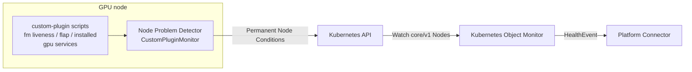

# Tutorial: Monitoring GPU System Services with Node Problem Detector

This tutorial extends an existing
[node-problem-detector (NPD)](https://github.com/kubernetes/node-problem-detector)
installation with `CustomPluginMonitor` checks for GPU-critical systemd
services, and configures NVSentinel to consume the resulting Node
Conditions.

By the end you will have:

- NPD actively probing `nvidia-fabricmanager` liveness, crash-loop (flap)
  behavior, and — on fleets that require Fabric Manager — unit presence, plus
  `nvidia-persistenced` liveness.
- Kubernetes Object Monitor (KOM) watching the opt-in `FabricManagerDown`,
  `FabricManagerFlapping`, `FabricManagerNotInstalled`, and
  `NvidiaPersistencedDown` conditions.
- A safe procedure for validating detection and KOM publication end to end.

> **Who is this for?** Cluster administrators who run NVSentinel on GPU nodes
> (especially NVSwitch platforms such as HGX H100/H200) and want service-level
> health for the NVIDIA host daemons that no DCGM or log-based check observes.

> **Just want the AI to do it?** Jump to
> [Appendix: One-shot AI prompt](#appendix-one-shot-ai-prompt).

> **Safety:** The Fabric Manager policies recommend `RESTART_BM`. Validate
> them only in a non-production cluster or while downstream quarantine and
> remediation components are disabled. Stopping `nvidia-fabricmanager` on an
> NVSwitch node interrupts NVLink fabric coordination: validate only on a
> drained, disposable node.

## Prerequisites

- Kubernetes 1.25 or later, Helm 3, and `kubectl`.
- An NPD installation on every GPU node to monitor (DaemonSet or host
  service). This tutorial was validated against NPD v1.36.0; the
  `CustomPluginMonitor` exit-status and permanent-condition contract it uses
  predates that release line.
- Root or SSH access to the GPU nodes (or the ability to modify the NPD
  DaemonSet) to install plugin scripts and configuration.
- Cluster-admin access for the NVSentinel Helm release.
- Shell or SSH access to at least one drained, disposable GPU node for
  end-to-end validation.

If NPD is not installed yet, follow
[Tutorial: Integrating Node Problem Detector](integrating-node-problem-detector.md)
first — including its guidance to never deploy a second NPD instance next to a
provider-managed one.

---

## 1. Understand the integration

The plugin scripts probe systemd through `systemctl show`; NPD publishes the
results as permanent Node Conditions; KOM turns matching conditions into
NVSentinel HealthEvents on the same path as the default NPD condition
integration.



This integration watches these condition and reason pairs:

| Condition type | Problem reason | KOM policy | Fatal | Action |
| --- | --- | --- | --- | --- |
| `FabricManagerDown` | `FabricManagerNotActive` | `NPDFabricManagerDown` | yes | `RESTART_BM` |
| `FabricManagerFlapping` | `FabricManagerFlapping` | `NPDFabricManagerFlapping` | yes | `RESTART_BM` |
| `FabricManagerNotInstalled` | `FabricManagerUnitNotFound` | `NPDFabricManagerNotInstalled` | yes | `CONTACT_SUPPORT` |
| `NvidiaPersistencedDown` | `NvidiaPersistencedNotActive` | `NPDNvidiaPersistencedDown` | no | `CONTACT_SUPPORT` |

Unlike log-matched NPD conditions, these are active probes: a healthy
observation sets the condition back to `False`, so recoveries clear without an
NPD restart.

**Platform applicability.** Install the `FabricManagerNotInstalled` rule only
on fleets where Fabric Manager is required (NVSwitch platforms) — it reports
a missing unit as a problem. The liveness and flap checks skip a not-found
unit, so they are safe to install fleet-wide, including PCIe-only nodes.

---

## 2. Install the plugin scripts and monitor configuration

The plugin scripts and monitor configuration ship in this repository under
`docs/tutorials/assets/npd-gpu-services/`:

- `check_fm_flapping.sh` — Fabric Manager crash-loop detection over a sliding
  window (defaults: 3 restarts within 600 s), with `systemctl reset-failed`
  disambiguation.
- `check_fm_installed.sh` — Fabric Manager unit presence (optional; required
  fleets only).
- `check_gpu_service.sh` — parameterized service liveness with
  consecutive-probe debounce and hold-state semantics; the reference rules
  invoke it for `nvidia-fabricmanager` and `nvidia-persistenced` (one rule,
  condition, and state file per unit, so the checks stay independent).
- `custom-plugin-fm-liveness.json`, `custom-plugin-fm-flap.json`,
  `custom-plugin-fm-presence.json`, `custom-plugin-persistenced.json` — one
  single-condition `CustomPluginMonitor` configuration per check. The split
  matters: NPD publishes each monitor's conditions only from that monitor's
  own probe results, so an NPD restart can never briefly report a
  not-yet-probed condition as healthy.

The scripts need the same host visibility NPD's own checks use: access to
systemd via `systemctl`. How they reach the nodes depends on the NPD
deployment shape.

### Host-service NPD

Copy the scripts and configuration onto each GPU node:

```bash
sudo install -d -m 0755 /etc/npd-plugins
sudo install -m 0755 check_fm_flapping.sh check_gpu_service.sh \
  /etc/npd-plugins/
# Required-FM fleets only:
sudo install -m 0755 check_fm_installed.sh /etc/npd-plugins/

sudo install -m 0644 custom-plugin-fm-liveness.json \
  custom-plugin-fm-flap.json custom-plugin-persistenced.json \
  /etc/node-problem-detector/
# Required-FM fleets only:
sudo install -m 0644 custom-plugin-fm-presence.json /etc/node-problem-detector/
```

Add the monitor to the NPD service arguments and restart it:

```bash
# Append to the existing --config.custom-plugin-monitor list (comma-separated)
# in the NPD unit's arguments:
#   --config.custom-plugin-monitor=/etc/node-problem-detector/custom-plugin-fm-liveness.json,/etc/node-problem-detector/custom-plugin-fm-flap.json,/etc/node-problem-detector/custom-plugin-persistenced.json
# Required-FM fleets also append custom-plugin-fm-presence.json.
sudo systemctl daemon-reload
sudo systemctl restart node-problem-detector
```

### DaemonSet NPD

Distribute the files with your configuration-management mechanism (a
ConfigMap for the JSON and scripts, or node provisioning for the scripts),
then update the DaemonSet:

1. Mount the scripts executable at `/etc/npd-plugins/` and the JSON files
   where the NPD container reads configuration.
2. Append the monitors to the container arguments as one comma-separated
   `--config.custom-plugin-monitor=...` list (presence config on
   required-FM fleets only).
3. **Mount the host's `/var/run/nvsentinel/npd` for the per-check state.**
   The checks keep their debounce counts, hold state, and the flap
   restart-window baseline under `/var/run/nvsentinel/npd/` on the host's
   tmpfs (the same tree the NVSentinel health-monitor DaemonSets already
   mount for the platform-connector socket), so state is boot-scoped. A
   pod-local path resets it on every pod replacement, silently weakening
   flap detection and the debounce:

```yaml
        volumeMounts:
          - name: nvsentinel-npd-state
            mountPath: /var/run/nvsentinel/npd
      volumes:
        - name: nvsentinel-npd-state
          hostPath:
            path: /var/run/nvsentinel/npd
            type: DirectoryOrCreate
```

4. The scripts run `systemctl`. Provider NPD images and DaemonSets that
   already run service checks have this plumbing. The upstream NPD image
   ships no `systemctl`: the robust pattern is a shim — mount the node's
   root read-only at `/host` and place this first on the container `PATH`
   (query verbs such as `systemctl show` work in a chroot through the
   host's `/run/systemd/private` socket):

```bash
#!/bin/bash
exec chroot /host /usr/bin/systemctl "$@"
```

Roll the DaemonSet and confirm every pod restarts ready:

```bash
kubectl rollout status daemonset "$NPD_DAEMONSET" \
  --namespace "$NPD_NAMESPACE" --timeout=5m
# Expected:
# daemon set "node-problem-detector" successfully rolled out
```

### Confirm the healthy baseline

Each configuration sets `skip_initial_status: true`, so NPD publishes each
condition only after its own first probe completes (within
`invoke_interval` + rule `timeout`, at most ~42 s after startup):

```bash
NODE="<gpu-node-name>"
kubectl get node "$NODE" \
  -o jsonpath='{range .status.conditions[*]}{.type}={.status}{" reason="}{.reason}{"\n"}{end}' |
  grep -E '^(FabricManagerDown|FabricManagerFlapping|FabricManagerNotInstalled|NvidiaPersistencedDown)='
# Expected on a healthy required-FM (NVSwitch) node — four conditions:
# FabricManagerDown=False reason=FabricManagerActive
# FabricManagerFlapping=False reason=FabricManagerStable
# FabricManagerNotInstalled=False reason=FabricManagerInstalled
# NvidiaPersistencedDown=False reason=NvidiaPersistencedActive
# Fleets that omit the presence configuration expect three (no
# FabricManagerNotInstalled).
```

On a PCIe-only node the Fabric Manager unit is absent: the liveness and flap
checks stay `False` ("not applicable"), and the presence condition appears
only if you installed its rule — which required fleets do and PCIe-only
fleets do not.

---

## 3. Configure NVSentinel and KOM policies

The GPU-service policies are intentionally excluded from the default KOM
values, for the same reason as the default NPD policies: NVSentinel does not install NPD or
control how an operator handles its conditions. The opt-in overlay
`distros/kubernetes/nvsentinel/values-npd-gpu-services.yaml` provides them
(shipped with the companion chart change). Per fleet scenario: required-FM
fleets enable all four policies; fleets with container-managed FM or no FM
enable `NPDNvidiaPersistencedDown` only.

Helm replaces lists rather than merging their entries, so the overlay repeats
the default `ReplaceNotReadyNode` policy. If the cluster already uses
`values-npd-remediation.yaml` (or custom KOM policies), merge all policy
lists into one file before installing.

```bash
NVSENTINEL_VERSION="<release-containing-the-gpu-service-policies>"

helm upgrade --install nvsentinel oci://ghcr.io/nvidia/nvsentinel \
  --version "$NVSENTINEL_VERSION" \
  --namespace nvsentinel \
  --create-namespace \
  --reuse-values \
  --values values-npd-gpu-services.yaml \
  --wait

kubectl rollout status deployment/kubernetes-object-monitor \
  --namespace nvsentinel \
  --timeout=5m
# Expected:
# deployment "kubernetes-object-monitor" successfully rolled out
```

---

## 4. Validate the integration

Validate on a **drained, disposable GPU node**. Start with
`nvidia-persistenced` — its policy is non-fatal, so it exercises the full
NPD → KOM → HealthEvent path with the least blast radius — then, if the node
is safe for it, validate the fatal Fabric Manager path.

### 4a. Non-fatal path: nvidia-persistenced

SSH to `$NODE` and stop the service:

```bash
sudo systemctl stop nvidia-persistenced
```

The liveness checks debounce: a down report requires 3 consecutive
non-running probes (≈ 90 s at the reference interval), so a planned restart
never fires the condition. After ~2 minutes, confirm the source condition:

```bash
kubectl get node "$NODE" \
  -o jsonpath='{range .status.conditions[*]}{.type}={.status}{" reason="}{.reason}{"\n"}{end}' |
  grep '^NvidiaPersistencedDown='
# Expected:
# NvidiaPersistencedDown=True reason=NvidiaPersistencedNotActive
```

Confirm KOM published the policy condition:

```bash
kubectl get node "$NODE" \
  -o jsonpath='{range .status.conditions[*]}{.type}={.status}{" reason="}{.reason}{"\n"}{end}' |
  grep '^NPDNvidiaPersistencedDown='
# Expected:
# NPDNvidiaPersistencedDown=True reason=NPDNvidiaPersistencedDownIsNotHealthy
```

Restart the service and watch both conditions clear on the next probe —
recovery confirms immediately (the debounce applies only to the unhealthy
direction), without an NPD restart:

```bash
sudo systemctl start nvidia-persistenced
```

### 4b. Fatal path: Fabric Manager (drained NVSwitch node only)

```bash
sudo systemctl stop nvidia-fabricmanager
```

Confirm `FabricManagerDown=True reason=FabricManagerNotActive` and
`NPDFabricManagerDown=True` with the same commands, substituting the
condition names. If downstream remediation is enabled, the node should be
cordoned and a `RESTART_BM` remediation created — which is why the node must
be drained and disposable.

Restart Fabric Manager and confirm both conditions return to `False`:

```bash
sudo systemctl start nvidia-fabricmanager
```

### 4c. Flap detection

The flap window defaults to 3 restarts within 600 s of `Restart=` activity.
Manual `systemctl restart` invocations do not increment systemd's `NRestarts`
counter, so simulate crash-loop behavior by killing the main process and
letting systemd's `Restart=` policy bring it back, three times, at least a
few seconds apart:

```bash
for i in 1 2 3; do
  sudo systemctl kill --signal=SIGKILL nvidia-fabricmanager
  sleep 20
done
```

Confirm the flap condition (it reports independently of instantaneous
liveness — the unit may already be `active` again):

```bash
kubectl get node "$NODE" \
  -o jsonpath='{range .status.conditions[*]}{.type}={.status}{" reason="}{.reason}{"\n"}{end}' |
  grep '^FabricManagerFlapping='
# Expected:
# FabricManagerFlapping=True reason=FabricManagerFlapping
```

The condition clears on its own once the sliding window drains (up to 600 s
after the last observed restart). `systemctl reset-failed` flushes the
`NRestarts` counter but does **not** clear the flap window — the script
re-baselines and keeps its recorded observations, so a counter flush cannot
hide an active crash loop.

---

## Recovery semantics and NPD restarts

Two caveats apply when interpreting these conditions during remediation:

- **NPD restarts.** Each check runs as its own single-condition monitor
  with `skip_initial_status: true`, so an NPD restart publishes nothing for
  a condition until that condition's own probe completes — a condition that
  was `True` before the restart stays `True` until confirmed otherwise.
  Still: do not treat transitions observed around an NPD restart as proof of
  recovery, and do not restart NPD mid-remediation.
- **`Unknown` conditions.** The scripts hold their last confirmed state
  through probe failures: a faulted condition keeps reporting `True` until a
  probe confirms recovery, and a healthy one holds through four consecutive
  failures before reporting `Unknown` (after which the stale confirmation is
  discarded — following non-running observations report `Unknown` until the
  debounce threshold confirms either state). Treat `Unknown` as "could not
  observe", never as recovery.

---

## Troubleshooting

### The conditions never appear on the node

- Confirm the NPD process loaded the monitors: its log should list each
  `custom-plugin-*.json` configuration at startup.
- Confirm the scripts are executable at the paths in the JSON `rules`
  (`/etc/npd-plugins/...`) inside the NPD execution environment.
- With `skip_initial_status: true`, conditions publish only after the first
  probe batch — wait one `invoke_interval` plus the rule `timeout`.

```bash
kubectl logs "daemonset/$NPD_DAEMONSET" --namespace "$NPD_NAMESPACE" | head -50
# Expected when healthy: the custom plugin monitor starts without
# configuration or exec errors.
```

### A condition is stuck at Unknown

The scripts exit unknown when they cannot observe systemd. Check that
`systemctl` works inside the NPD execution environment (host D-Bus reachable
from the container for DaemonSet installs).

### Flap detection never fires

- On DaemonSet NPD, confirm the host's `/var/run/nvsentinel/npd` hostPath mount:
  without it the baseline resets with every pod replacement.
- Confirm the crash loop is systemd-driven: manual restarts do not increment
  `NRestarts` and are deliberately not counted.

### A condition flapped False briefly after an NPD restart

Expected: the first post-restart batch publishes each condition as its probe
completes (see Recovery semantics). The steady-state value within one probe
interval is the truth.

---

## Appendix: One-shot AI prompt

Paste this prompt into an AI coding agent with access to your NVSentinel
checkout. Replace the bracketed values before running it.

```text
Help me add the NVSentinel GPU system-service NPD checks to this cluster and
integrate them with NVSentinel:

- Kubernetes context: [context]
- NPD installation: [provider-managed, DaemonSet, or host service]
- NPD namespace / DaemonSet: [values, if known]
- NVSentinel version: [version]
- NVSwitch platform (Fabric Manager required): [yes or no]
- Validation node (drained + disposable): [node]
- Downstream remediation enabled: [yes or no]

Follow these requirements:

1. Inspect before changing anything: locate the NPD installation and its
   existing monitor configurations. Never deploy a second NPD instance.
2. Install the plugin scripts from docs/tutorials/assets/npd-gpu-services/
   at /etc/npd-plugins/ (0755) and the four custom-plugin-*.json
   single-condition monitor configurations in the NPD configuration
   directory. Include check_fm_installed.sh + custom-plugin-fm-presence.json
   only if Fabric Manager is required. For DaemonSet NPD, hostPath-mount the
   host's /var/run/nvsentinel/npd at the same path for the flap state, and
   confirm systemctl works in the container.
3. Append the monitor configs to the NPD arguments as one comma-separated
   --config.custom-plugin-monitor list and roll NPD. Confirm the healthy baseline: the four
   conditions False with their healthy reasons within ~1 minute.
4. Configure NVSentinel from
   distros/kubernetes/nvsentinel/values-npd-gpu-services.yaml, merging any
   existing KOM policies first (Helm replaces the policies list). Use one
   helm upgrade --install with --reuse-values and wait for
   deployment/kubernetes-object-monitor to roll out.
5. Validate on the disposable node only, non-fatal path first:
   stop nvidia-persistenced, confirm NvidiaPersistencedDown=True and
   NPDNvidiaPersistencedDown=True, restart it, confirm both clear without an
   NPD restart. Only if the node is drained and safe, repeat for
   nvidia-fabricmanager (fatal, RESTART_BM). For flap validation use
   systemctl kill --signal=SIGKILL three times ~20s apart, never manual
   restarts (NRestarts does not count them).
6. Interpret conditions per the recovery-semantics section above: never treat
   transitions observed around an NPD restart as recovery; Unknown means
   could-not-observe, not healthy.

Show each command before executing it. Do not run Helm, kubectl mutation,
SSH, or systemctl commands until I confirm the Kubernetes context, target
node, and remediation safety.
```
