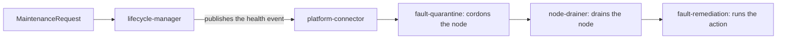

# Tutorial: Requesting Node Maintenance

This tutorial walks you through creating a **MaintenanceRequest**, which tells NVSentinel that a node needs planned maintenance. NVSentinel then cordons the node and drains its workloads before the maintenance starts.

By the end you will have:

- The MaintenanceRequest controller enabled on your cluster.
- The RBAC permissions to create a MaintenanceRequest.
- A tested maintenance cycle: NVSentinel cordons and drains a node, and uncordons the node after you delete the MaintenanceRequest.

> **Who is this for?** Teams that **already run NVSentinel** and must tell it about maintenance that it cannot detect. For example, a cloud provider sends a maintenance notice, or an operator plans a hardware replacement.

> **Just want the AI to do it?** Jump to [Appendix: One-shot AI prompt](#appendix-one-shot-ai-prompt).

> **Safety:** Use a test node that has no important workloads. NVSentinel cordons and drains the node that the MaintenanceRequest names. If you do not delete the MaintenanceRequest, the node stays cordoned.

---

## Prerequisites

- NVSentinel v1.25.0 or later.
- NVSentinel with fault-quarantine and node-drainer enabled. These components are disabled by default.
- Helm 3.14 or later and `kubectl`.
- Cluster-admin access to upgrade the NVSentinel Helm release and to create a ClusterRole.
- A test node that NVSentinel can cordon and drain.

See the [NVSentinel Helm chart guide](../../distros/kubernetes/README.md) for the complete NVSentinel prerequisites.

---

## 1. How a MaintenanceRequest works

A MaintenanceRequest is a Kubernetes custom resource that NVSentinel defines. It contains a [health event](../health-event-data-model.md) that names the node and the action for NVSentinel to take.



The health event names an action, such as a reboot. After node-drainer drains the node, fault-remediation runs that action.

The MaintenanceRequest stays in the cluster until you delete it. While it exists, the node stays cordoned. When you delete it, lifecycle-manager publishes a clearing event, and fault-quarantine uncordons the node.

> **Note:** NVSentinel acts when you create the MaintenanceRequest. It does not wait for `startTime`. The `startTime` field is for information only. NVSentinel shows the value in the `kubectl get` output but does not use it to schedule work.

For the design rationale and limitations, see [ADR-051](../designs/051-maintenance-request.md).

---

## 2. Enable the MaintenanceRequest controller

The lifecycle-manager component and its MaintenanceRequest controller are disabled by default. Create a values file that enables both:

```yaml
# values-maintenance-request.yaml
global:
  lifecycleManager:
    enabled: true

lifecycle-manager:
  controllers:
    maintenanceRequest:
      enabled: true
```

This setting also installs two webhooks and a ClusterRole. A webhook makes the Kubernetes API server check each MaintenanceRequest before it stores the object. Webhooks and ClusterRoles apply to the full cluster, so this step needs cluster-admin access.

> **Note:** If platform-connector authentication is enabled (`global.platformConnectorAuth.enabled: true`), this change restarts the platform-connector pod on every node. The chart adds lifecycle-manager to the list of callers that platform-connector accepts. While a platform-connector pod restarts, it cannot receive health events from its node.

Before you upgrade, make sure that the lifecycle-manager CRDs are in the cluster. Helm installs CRDs only when it installs a chart for the first time. It does not install them during `helm upgrade`.

```bash
kubectl get crd maintenancerequests.nvsentinel.dgxc.nvidia.com validationrequests.nvsentinel.nvidia.com
# Expected:
# NAME                                             CREATED AT
# maintenancerequests.nvsentinel.dgxc.nvidia.com   <timestamp>
# validationrequests.nvsentinel.nvidia.com         <timestamp>
```

If the command returns `NotFound`, apply the CRDs from the chart:

```bash
NVSENTINEL_VERSION="<v1.25.0 or later>"

helm pull oci://ghcr.io/nvidia/nvsentinel --version "$NVSENTINEL_VERSION" --untar
kubectl apply -f nvsentinel/charts/lifecycle-manager/crds/
# Expected:
# customresourcedefinition.apiextensions.k8s.io/maintenancerequests.nvsentinel.dgxc.nvidia.com created
# customresourcedefinition.apiextensions.k8s.io/validationrequests.nvsentinel.nvidia.com created
```

Apply the values file. The `--reset-then-reuse-values` flag applies the new chart defaults, then keeps your current values.

```bash
NVSENTINEL_VERSION="<v1.25.0 or later>"

helm upgrade nvsentinel oci://ghcr.io/nvidia/nvsentinel \
  --version "$NVSENTINEL_VERSION" \
  --namespace nvsentinel \
  --reset-then-reuse-values \
  --values values-maintenance-request.yaml \
  --wait
```

Make sure that lifecycle-manager is running:

```bash
kubectl rollout status deployment/lifecycle-manager \
  --namespace nvsentinel \
  --timeout=5m
# Expected:
# deployment "lifecycle-manager" successfully rolled out
```

The chart configures authentication and the quarantine rule for you. To learn how they work, or to see every check that the webhook applies, read [Lifecycle Manager Configuration](../configuration/lifecycle-manager.md).

---

## 3. Grant RBAC to a ServiceAccount

If you create MaintenanceRequests by hand with cluster-admin access, skip this section.

A program that creates MaintenanceRequests needs its own permissions. Kubernetes gives each program an identity called a ServiceAccount. The ServiceAccount needs a ClusterRole, because a MaintenanceRequest belongs to the full cluster and not to one namespace.

Save this file as `maintenancerequest-rbac.yaml`. Change `maintenance-automation` and `maintenance` to the name and namespace of your ServiceAccount.

```yaml
apiVersion: rbac.authorization.k8s.io/v1
kind: ClusterRole
metadata:
  name: maintenancerequest-writer
rules:
  - apiGroups: ["nvsentinel.dgxc.nvidia.com"]
    resources: ["maintenancerequests"]
    verbs: ["create", "get", "list", "watch", "delete"]
---
apiVersion: rbac.authorization.k8s.io/v1
kind: ClusterRoleBinding
metadata:
  name: maintenancerequest-writer
roleRef:
  apiGroup: rbac.authorization.k8s.io
  kind: ClusterRole
  name: maintenancerequest-writer
subjects:
  - kind: ServiceAccount
    name: maintenance-automation
    namespace: maintenance
```

| Verb | Why the program needs it |
| --- | --- |
| `create` | To start maintenance on a node. |
| `get`, `list`, `watch` | To read the `HealthEventEmitted` condition. |
| `delete` | To end maintenance and return the node to service. |

Apply the file:

```bash
kubectl apply -f maintenancerequest-rbac.yaml
# Expected:
# clusterrole.rbac.authorization.k8s.io/maintenancerequest-writer created
# clusterrolebinding.rbac.authorization.k8s.io/maintenancerequest-writer created
```

Make sure that the ServiceAccount can create a MaintenanceRequest:

```bash
kubectl auth can-i create maintenancerequests.nvsentinel.dgxc.nvidia.com \
  --as=system:serviceaccount:maintenance:maintenance-automation
# Expected:
# yes
```

---

## 4. Create a MaintenanceRequest

Create the MaintenanceRequest at the time you want NVSentinel to drain the node.

Set the name of your test node:

```bash
export NODE=<node-name>
```

Create a MaintenanceRequest for the node:

```bash
kubectl apply -f - <<EOF
apiVersion: nvsentinel.dgxc.nvidia.com/v1
kind: MaintenanceRequest
metadata:
  name: maintenance-${NODE}
spec:
  healthEvent:
    version: 1
    agent: my-maintenance-tool
    componentClass: Node
    checkName: PlannedMaintenance
    nodeName: ${NODE}
    isHealthy: false
    isFatal: false
    recommendedAction: NONE
    message: "Planned hardware maintenance"
EOF
# Expected:
# maintenancerequest.nvsentinel.dgxc.nvidia.com/maintenance-<node-name> created
```

| Field | Required | Description |
| --- | --- | --- |
| `nodeName` | Yes | The node to prepare. The node must exist. |
| `version` | Yes | The health event format version. Use `1`. |
| `isHealthy` | Yes | Use `false`. The webhook rejects `true`. |
| `checkName` | No | A name for this maintenance. The clearing event uses the same name. |
| `recommendedAction` | No | The action after the drain. The default is `NONE`. |
| `agent` | No | The name of your tool. |
| `componentClass` | No | The part of the node that the maintenance affects. Use `Node`. |
| `isFatal` | No | Use `false`, because planned maintenance is not a hardware fault. |
| `message` | No | A description that operators see. |
| `spec.startTime` | No | When the maintenance starts. The time must be in the future. |

This MaintenanceRequest uses `recommendedAction: NONE`. NVSentinel cordons and drains the node, and then does no other work. To make NVSentinel do more work after the drain, change `recommendedAction`.

fault-remediation selects the work after the drain. Its configuration maps each `recommendedAction` to a maintenance resource. The table shows the result with the default fault-remediation configuration. If you changed `maintenance.actions` in the fault-remediation Helm values, the result can be different.

| `recommendedAction` | What NVSentinel does after the drain |
| --- | --- |
| `NONE` | Nothing. The node stays cordoned until you delete the MaintenanceRequest. |
| `RESTART_VM` | fault-remediation creates a RebootNode resource, and janitor reboots the node. |
| `CUSTOM`, with `customRecommendedAction: external-remediation` | fault-remediation releases the node to an external system. This action needs more configuration. See [Integrating External Remediation](./integrating-external-remediation.md). |

> **Note:** The webhook replaces the value of `agent` with `lifecycle-manager`. The webhook keeps your value in `healthEvent.metadata.maintenanceRequestRequesterAgent`.

> **Note:** The webhook does not let you change `spec.healthEvent` after you create the MaintenanceRequest.

---

## 5. Validate the MaintenanceRequest

Run the commands in this section while the MaintenanceRequest exists. You delete the MaintenanceRequest in section 6.

Wait for lifecycle-manager to publish the health event:

```bash
kubectl wait maintenancerequest "maintenance-${NODE}" \
  --for=condition=HealthEventEmitted \
  --timeout=2m
# Expected:
# maintenancerequest.nvsentinel.dgxc.nvidia.com/maintenance-<node-name> condition met
```

Make sure that NVSentinel cordoned and drained the node. The `-L` flag adds a column for the NVSentinel state label.

```bash
kubectl get node "$NODE" -L dgxc.nvidia.com/nvsentinel-state
# Expected when the drain is complete:
# NAME          STATUS                     ROLES     AGE     VERSION     NVSENTINEL-STATE
# <node-name>   Ready,SchedulingDisabled   <roles>   <age>   <version>   drain-succeeded
```

`SchedulingDisabled` shows that fault-quarantine cordoned the node. The `NVSENTINEL-STATE` column shows the progress of the drain:

| Value | Meaning |
| --- | --- |
| `quarantined` | fault-quarantine cordoned the node. The drain did not start yet. |
| `draining` | The drain started. node-drainer evicts the pods from the node. |
| `drain-succeeded` | node-drainer evicted all pods. The node is ready for maintenance. |
| `drain-failed` | node-drainer could not evict all pods from the node. |

If the value is `quarantined` or `draining`, run the command again after a few seconds.

For all values of this label, see [State Manager](../state-manager.md).

---

## 6. Return the node to service

When the maintenance is complete, delete the MaintenanceRequest:

```bash
kubectl delete maintenancerequest "maintenance-${NODE}"
# Expected:
# maintenancerequest.nvsentinel.dgxc.nvidia.com "maintenance-<node-name>" deleted
```

The MaintenanceRequest has a finalizer. A finalizer stops Kubernetes from removing an object until a controller completes its cleanup. Here, lifecycle-manager first publishes the clearing event. Then lifecycle-manager removes the finalizer, and Kubernetes removes the MaintenanceRequest.

Make sure that fault-quarantine uncordoned the node:

```bash
kubectl get node "$NODE" -L dgxc.nvidia.com/nvsentinel-state
# Expected:
# NAME          STATUS   ROLES     AGE     VERSION     NVSENTINEL-STATE
# <node-name>   Ready    <roles>   <age>   <version>
```

The status no longer shows `SchedulingDisabled`, and the `NVSENTINEL-STATE` column is empty. If the node still shows `SchedulingDisabled`, run the command again after a few seconds.

> **Note:** NVSentinel uncordons the node when you delete the MaintenanceRequest, even if the action from `recommendedAction` did not finish.

---

## Troubleshooting

### The API server rejects the MaintenanceRequest

The webhook checks each MaintenanceRequest before the API server stores it. If a check fails, `kubectl` shows the reason at the end of the error:

```text
Error from server (Forbidden): error when creating "STDIN": admission webhook "vmaintenancerequest-v1.kb.io" denied the request: <message>
```

| Message | Fix |
| --- | --- |
| `MaintenanceRequest controller is disabled` | Enable the controller. See [section 2](#2-enable-the-maintenancerequest-controller). |
| `spec.healthEvent.nodeName is required` | Set `nodeName` to the name of the node. |
| `spec.healthEvent.nodeName references non-existent node "<node-name>"` | Use a node name from the output of `kubectl get nodes`. |
| `spec.healthEvent.version is required` | Set `version: 1`. |
| `spec.healthEvent.isHealthy must be false for an opening event` | Set `isHealthy: false`. |
| `spec.startTime must be in the future` | Set a time in the future, or remove `startTime`. |
| `spec.healthEvent is immutable after creation`, or `spec.healthEvent.<field> is immutable after creation` | Delete the MaintenanceRequest, then create a new one. |

> **Note:** When you delete the MaintenanceRequest, NVSentinel uncordons the node. Pods can start on the node before you create the new MaintenanceRequest.

### The HealthEventEmitted condition is False

Read the reason and the message of the condition:

```bash
kubectl get maintenancerequest "maintenance-${NODE}" \
  -o jsonpath='{range .status.conditions[*]}{.type}={.status} reason={.reason} message={.message}{"\n"}{end}'
# Expected when another operation holds the node:
# HealthEventEmitted=False reason=Blocked message=Node <node-name> is locked by another maintenance operation.
```

| Reason | Meaning | Fix |
| --- | --- | --- |
| `Blocked` | Another operation holds the lock on the node. Examples are a second MaintenanceRequest or a janitor reboot on the same node. lifecycle-manager tries again every 30 seconds. | Wait for the other operation to complete, or delete the second MaintenanceRequest. |
| `EmitFailed` | lifecycle-manager could not publish the health event to platform-connector. lifecycle-manager tries again. | Make sure that platform-connector runs on the same node as lifecycle-manager. |

lifecycle-manager sends the health event through a socket on its own node. Compare the `NODE` column of the two pods:

```bash
kubectl get pods --namespace nvsentinel -o wide | grep -E "lifecycle-manager|platform-connector"
# Expected: one platform-connector pod has the same NODE value as the lifecycle-manager pod.
```

### NVSentinel does not cordon the node

If the `HealthEventEmitted` condition is `True` but the node does not show `SchedulingDisabled`, check these causes in order.

1. **fault-quarantine is not enabled.** fault-quarantine is disabled by default.

   ```bash
   kubectl rollout status deployment/fault-quarantine --namespace nvsentinel --timeout=1m
   # Expected:
   # deployment "fault-quarantine" successfully rolled out
   ```

   If the deployment does not exist, set `global.faultQuarantine.enabled: true` in your NVSentinel Helm values.

2. **The node is opted out of NVSentinel.** fault-quarantine does not cordon a node when one of these labels has the value `false`:

   - `nvsentinel.dgxc.nvidia.com/managed`
   - `k8saas.nvidia.com/ManagedByNVSentinel`

   Show the value of both labels on the node. The `-L` flags add a `MANAGED` column and a `MANAGEDBYNVSENTINEL` column.

   ```bash
   kubectl get node "$NODE" -L nvsentinel.dgxc.nvidia.com/managed -L k8saas.nvidia.com/ManagedByNVSentinel
   # Expected for a node that NVSentinel manages:
   # NAME          STATUS   ROLES     AGE     VERSION     MANAGED   MANAGEDBYNVSENTINEL
   # <node-name>   Ready    <roles>   <age>   <version>
   ```

   If the `MANAGED` column or the `MANAGEDBYNVSENTINEL` column shows `false`, the node is opted out.

3. **The circuit breaker tripped.** fault-quarantine stops all cordons when too many nodes are cordoned. First, make sure that the circuit breaker is enabled:

   ```bash
   kubectl get deployment fault-quarantine -n nvsentinel -o yaml | grep -o "circuit-breaker-enabled=[a-z]*"
   # Expected when the circuit breaker is enabled:
   # circuit-breaker-enabled=true
   ```

   If the value is `false`, the circuit breaker does not stop cordons, so go to the next cause. The `circuit-breaker` ConfigMap can keep an old `TRIPPED` value after the circuit breaker is disabled.

   If the value is `true`, check the circuit breaker state:

   ```bash
   kubectl get configmap circuit-breaker -n nvsentinel -o jsonpath='{.data.status}'
   # Expected when the circuit breaker did not trip:
   # CLOSED
   ```

   If the value is `TRIPPED`, follow the [circuit breaker runbook](../runbooks/circuit-breaker.md).

4. **The quarantine rule is missing.** fault-quarantine cordons the node only if a ruleset matches the health event.

   ```bash
   kubectl get configmap fault-quarantine -n nvsentinel -o yaml | grep "MaintenanceRequest ruleset"
   # Expected: one line that contains MaintenanceRequest ruleset.
   ```

   If the output is empty, restore the `MaintenanceRequest ruleset` entry in `fault-quarantine.ruleSets`.

5. **platform-connector rejected the health event.** For the authentication checks and the `platform_connector_auth_violations_total` metric, see [Lifecycle Manager Configuration](../configuration/lifecycle-manager.md#authentication).

### The drain state is drain-failed

node-drainer could not evict all pods from the node. The node stays cordoned. List the pods that are still on the node:

```bash
kubectl get pods --all-namespaces --field-selector spec.nodeName="$NODE"
```

A PodDisruptionBudget or the node-drainer eviction mode can stop an eviction. For the eviction modes, see [Node Drainer Configuration](../configuration/node-drainer.md).

### The MaintenanceRequest stays after you delete it

lifecycle-manager removes the finalizer only after platform-connector accepts the clearing event. Until then, the `kubectl delete` command waits and does not show the `deleted` message. Ctrl+C stops only the wait. The API server already marked the MaintenanceRequest for deletion, so the deletion continues.

Make sure that the deletion is waiting for the finalizer:

```bash
kubectl get maintenancerequest "maintenance-${NODE}" -o jsonpath='{.metadata.deletionTimestamp}'
# Expected when the deletion is waiting for the finalizer: a timestamp.
```

lifecycle-manager cannot publish the clearing event. Use the `EmitFailed` fix in [The HealthEventEmitted condition is False](#the-healtheventemitted-condition-is-false). When the clearing event succeeds, lifecycle-manager removes the finalizer.

If you cannot repair platform-connector, remove the finalizer yourself.

> **Safety:** If you remove the finalizer, lifecycle-manager does not publish the clearing event. The node stays cordoned until you uncordon it. An uncordon also cancels every other active fault on the node, so check the other faults first.

```bash
kubectl patch maintenancerequest "maintenance-${NODE}" --type=merge -p '{"metadata":{"finalizers":null}}'
# Expected:
# maintenancerequest.nvsentinel.dgxc.nvidia.com/maintenance-<node-name> patched
```

Show the health events that keep the node cordoned:

```bash
kubectl get node "$NODE" -o jsonpath='{.metadata.annotations.quarantineHealthEvent}'
# Expected: a list of the health events that keep the node cordoned.
```

If the list contains only the `checkName` of your MaintenanceRequest, uncordon the node:

```bash
kubectl uncordon "$NODE"
# Expected:
# node/<node-name> uncordoned
```

If the list contains other checks, keep the node cordoned. Uncordon it only after those faults clear. For what NVSentinel does when you uncordon a node, see [Cancelling Break-Fix Workflows](../cancelling-breakfix.md).

### The node stays cordoned after you delete the MaintenanceRequest

Show the health events that keep the node cordoned:

```bash
kubectl get node "$NODE" -o jsonpath='{.metadata.annotations.quarantineHealthEvent}'
# Expected: a list of the health events that keep the node cordoned.
```

- If the output contains the `checkName` of your MaintenanceRequest, fault-quarantine did not process the clearing event. Check the circuit breaker, as in [NVSentinel does not cordon the node](#nvsentinel-does-not-cordon-the-node). A tripped circuit breaker also stops the uncordon.
- If the output contains only other checks, other faults keep the node cordoned. NVSentinel uncordons the node when those faults clear.

---

## Appendix: One-shot AI prompt

Paste this prompt into an AI coding agent that has access to your cluster. Replace the bracketed values before you run it.

```text
Help me put a node into maintenance with an NVSentinel MaintenanceRequest in this cluster:

- Kubernetes context: [context]
- NVSentinel namespace: [namespace, default nvsentinel]
- NVSentinel Helm release: [release, default nvsentinel]
- NVSentinel version: [v1.25.0 or later]
- Target node: [node]
- ServiceAccount for automation: [namespace/name, or none if I create MaintenanceRequests by hand]

Follow these requirements:

1. Inspect before changing anything.
   - Confirm that Helm is 3.14 or later.
   - Check whether global.lifecycleManager.enabled and
     lifecycle-manager.controllers.maintenanceRequest.enabled are already true
     in the current release values.
   - Confirm that the target node exists and runs no important workloads.
   - Confirm that the node has neither nvsentinel.dgxc.nvidia.com/managed=false
     nor k8saas.nvidia.com/ManagedByNVSentinel=false.
   - If fault-quarantine runs with --circuit-breaker-enabled=true, confirm that
     the circuit-breaker ConfigMap reports status CLOSED.

2. If the controller is not enabled, enable it.
   - Write a values file that sets both keys to true.
   - Check that the CRDs maintenancerequests.nvsentinel.dgxc.nvidia.com and
     validationrequests.nvsentinel.nvidia.com exist. If they do not, pull the
     chart with helm pull --untar and kubectl apply its
     charts/lifecycle-manager/crds/ folder. Helm does not install CRDs on upgrade.
   - If global.platformConnectorAuth.enabled is true, tell me that this upgrade
     restarts platform-connector on every node.
   - Run helm upgrade with --reset-then-reuse-values and the values file. Do not
     use --reuse-values: it passes null for global.platformConnectorAuth.enabled,
     and the chart rejects null.
   - Wait for deployment/lifecycle-manager to roll out.

3. If I gave a ServiceAccount, create a ClusterRole and a ClusterRoleBinding with
   create, get, list, watch and delete on maintenancerequests in the
   nvsentinel.dgxc.nvidia.com API group. Confirm with kubectl auth can-i.

4. Create a cluster-scoped MaintenanceRequest (apiVersion
   nvsentinel.dgxc.nvidia.com/v1) named maintenance-[node]. In spec.healthEvent,
   set version: 1, nodeName, isHealthy: false, isFatal: false,
   componentClass: Node, a checkName, a message and recommendedAction: NONE.
   Omit spec.startTime. NVSentinel acts when the MaintenanceRequest is created
   and does not wait for startTime.

5. Validate while the MaintenanceRequest exists.
   - Run kubectl wait for the HealthEventEmitted condition.
   - Confirm that the node shows SchedulingDisabled and that the
     dgxc.nvidia.com/nvsentinel-state label reaches drain-succeeded.
   - If a check fails, follow the Troubleshooting section of
     docs/tutorials/requesting-node-maintenance.md.

6. When I say that the maintenance is complete, delete the MaintenanceRequest.
   Confirm that the node is uncordoned and that the nvsentinel-state label is
   gone. Never remove the finalizer unless I ask you to.

Show each command before you run it. Do not run helm upgrade, kubectl apply,
kubectl delete or kubectl patch until I confirm the Kubernetes context and the
target node.
```
